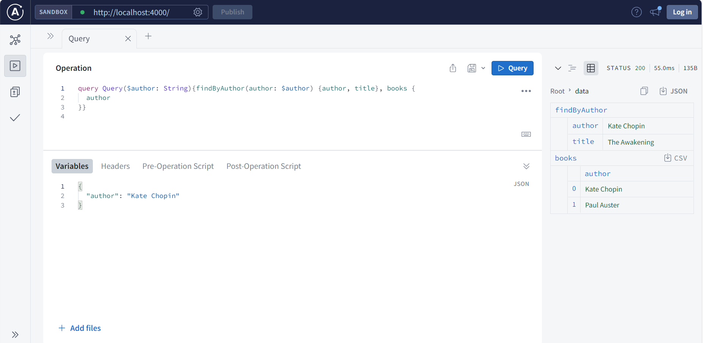

## Get started with Apollo Server

This is a simple example of GraphQL and Apollo Server.

References:
https://www.apollographql.com/docs/apollo-server/getting-started/

### Here's an example of how this can be used for insomnia:
~~~
{
	"query": "query Query($author: String){findByAuthor(author: $author) {author, title}}",
	"variables": {
		"author": "Kate Chopin"
	},
	"operationName": "Query"
}
~~~

## Here's other example using Apollo server:
